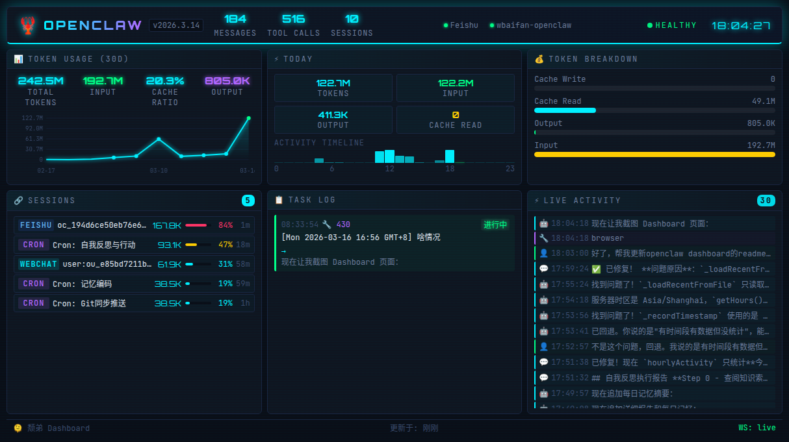

# OpenClaw Dashboard

A cyberpunk-style real-time monitoring dashboard for [OpenClaw](https://github.com/openclaw/openclaw).



## Features

### Token Usage
- 30-day trend chart with daily cost breakdown
- Accurate token accumulation across all API calls
- Local timezone-aware statistics

### Today's Stats
- **Messages & Tool Calls** — Real-time count of messages and tool invocations
- **Hourly Activity Timeline** — Visual heatmap of activity over the last 24 hours
- Timezone-aware display (respects local time, not UTC)
- Automatic recovery from history on restart

### Cost Breakdown
- Visual bar chart of cache write/read, output, and input costs
- Daily totals with trend indicators

### Sessions
- Active sessions with channel badges and token counts
- Context window usage bars
- Multi-agent support (displays all agents automatically)

### Task Log
- Auto-extracted task summaries from session logs
- Status indicators for task progress
- Markdown rendering with Feishu card compatibility

### Live Activity
- Real-time feed of messages and tool calls
- Smart deduplication: each tool type shows only the latest call
- WebSocket push with 100ms debounce for instant updates
- Filters: `exec`, `read`, `edit`, `process`, `write` tools shown (configurable)

### Channels & Devices
- Health status of connected channels and devices
- Real-time presence indicators

## Technical Highlights

### Accurate Statistics
- **Token accumulation**: Counts all assistant message usage (not just the last one per prompt)
- **Timezone-aware**: Uses local timezone for "today" calculations
- **History recovery**: Restores stats from session files on restart
- **Complete file reading**: No 5MB limit, ensures accurate counts

### Real-time Updates
- WebSocket push with 100ms debounce (5x faster than before)
- Differential updates: only re-renders changed components
- React.memo + useMemo optimization for smooth performance

### Multi-Agent Support
- Automatically discovers all agents in `~/.openclaw/agents/`
- Tracks sessions for all agents simultaneously
- No manual configuration needed

## How It Works

The dashboard server connects directly to the OpenClaw Gateway via its **WebSocket protocol** (device auth v3, ed25519 signing). It fetches health, status, and presence data through Gateway RPC calls, and tails session log files for real-time activity tracking.

Usage cost data is collected by scanning session log files and accumulating token usage from each assistant message.

## Project Structure

```
packages/
  server/    — Express + WebSocket backend (TypeScript)
  web/       — React + Vite frontend (TypeScript)
dist/        — Single build output
  server.js  — Compiled server
  public/    — Vite-built frontend assets
```

## Deployment

### Prerequisites

- Node.js 18+
- A running [OpenClaw](https://github.com/openclaw/openclaw) gateway on the same machine

The dashboard connects to the OpenClaw Gateway at `127.0.0.1:18789` (configurable via `GW_PORT`). Both services must run on the same host.

### Build

```bash
git clone https://github.com/xingrz/openclaw-dashboard.git
cd openclaw-dashboard
npm install
npm run build
```

This produces a single `dist/` directory containing the compiled server and frontend assets.

### Run

```bash
npm start
# or directly:
node dist/server.js
```

The dashboard listens on `http://0.0.0.0:3210` by default.

### Environment Variables

| Variable | Default | Description |
|----------|---------|-------------|
| `PORT` | `3210` | Dashboard server port |
| `HOST` | `0.0.0.0` | Dashboard bind address |
| `GW_PORT` | `18789` | Gateway WebSocket port |
| `OPENCLAW_GATEWAY_TOKEN` | *(auto-detected)* | Gateway auth token |

The gateway token is auto-detected from `~/.openclaw/openclaw.json` if not set.

### Reverse Proxy

**Caddy:**

```caddyfile
your.domain {
    handle_path /dashboard/* {
        reverse_proxy localhost:3210
    }
}
```

**nginx:**

```nginx
location /dashboard/ {
    proxy_pass http://127.0.0.1:3210/;
    proxy_http_version 1.1;
    proxy_set_header Upgrade $http_upgrade;
    proxy_set_header Connection "upgrade";
    proxy_set_header Host $host;
}
```

> **Note:** The `proxy_set_header Upgrade` / `Connection` directives are required for WebSocket support.

### systemd Service

```ini
[Unit]
Description=OpenClaw Dashboard
After=network.target

[Service]
Type=simple
User=your-user
WorkingDirectory=/path/to/openclaw-dashboard
ExecStart=/usr/bin/node dist/server.js
Restart=always
RestartSec=5
Environment=PORT=3210
Environment=PATH=/home/your-user/.npm-global/bin:/usr/local/bin:/usr/bin:/bin

[Install]
WantedBy=multi-user.target
```

```bash
sudo cp openclaw-dashboard.service /etc/systemd/system/
sudo systemctl daemon-reload
sudo systemctl enable --now openclaw-dashboard
```

## Development

Frontend and backend run separately during development:

```bash
# Terminal 1: backend server (auto-reloads on changes)
npm run dev:server

# Terminal 2: Vite dev server with HMR (proxies API/WS to backend)
npm run dev:web
```

The Vite dev server runs on `http://localhost:5173` with hot module replacement.

## Changelog

### Latest Improvements
- **Activity Timeline**: Shows last 24 hours (not just "today")
- **Token Statistics**: Accurate accumulation across all API calls
- **Timezone Support**: All times use local timezone
- **History Recovery**: Stats persist across restarts
- **Session Coverage**: Includes `.deleted` and `.reset` session files
- **Live Activity**: Real-time tool call feed with smart deduplication
- **Performance**: 100ms debounce, differential updates, React optimization
- **Multi-Agent**: Automatic discovery of all agents

## License

[MIT](LICENSE)
